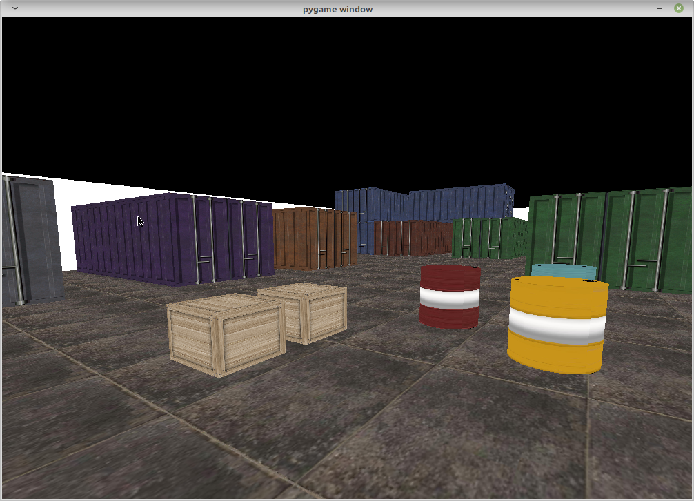

# Simple FPS using pygame and pyopengl

## Screenshots


## How to Run

```shell
git clone https://github.com/p4je/Pygame-FPS.git
cd Pygame-FPS
python3 -m pip install -r requirements.txt
python3 main.py
```

## How to Navigate

### Moving

- W: forward
- S: back
- A: strafe left
- D: strafe right
- Mouse: look around
- Up: move up
- Down: come down

### Quitting

- ESC: quit
